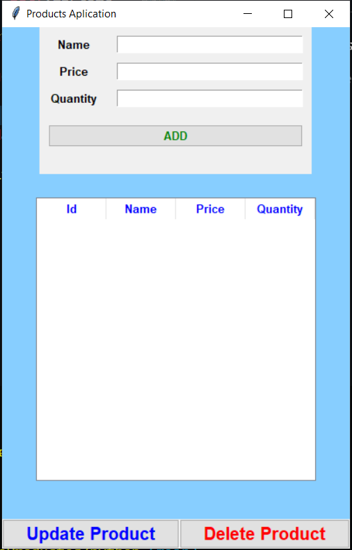
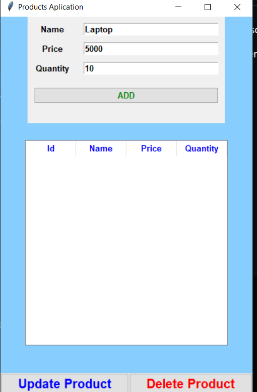
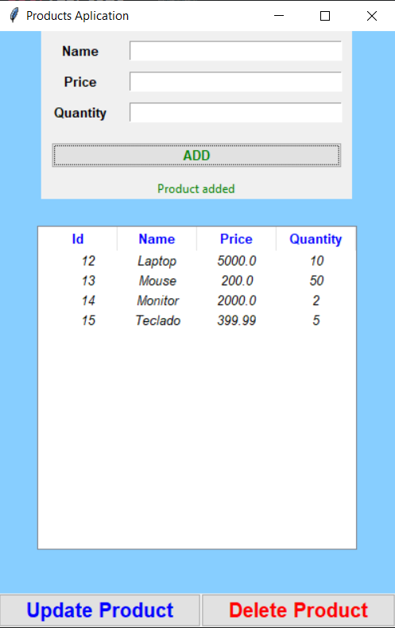
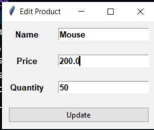
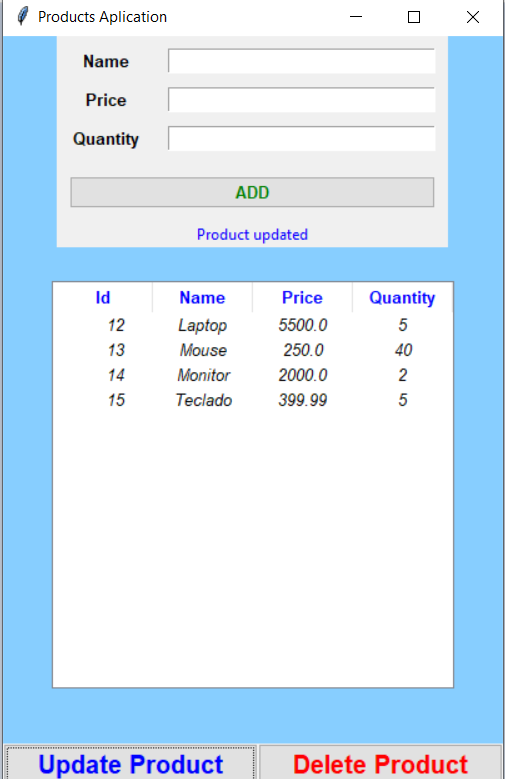

# **ControlDeProductos**

Aplicacion de escritorio realizada con tkinter, python y mySql.

La aplicacion permite la gestion de productos. Crear, modificar, eliminar y ver productos.

Al inicio se muestra una lista de productos, con un boton para agregar un nuevo producto.

___
## Crear un nuevo producto

___
## Modificar un producto

___
## Eliminar un producto
Para eliminar un se debe seleccionar el producto de la tabla y presionar el boton eliminar.